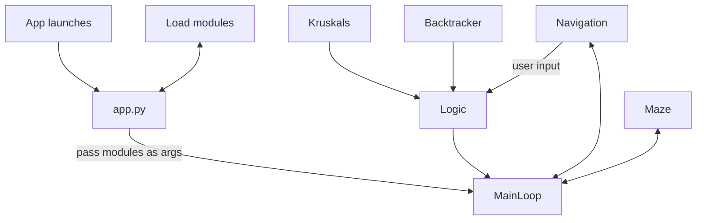

### Implementation document

The main application class will initiate different modules, such as the TkInter window and the logic class, and start the mainloop,
passing previously loaded modules forwards as arguments. The mainloop will initiate a parent TkInter frame to store the navigation bar and the canvas for maze generation.
The logic class handles most inputs within the application/starting the algorithms, with the navigation class initiating the calls when the user clicks a button.

**A simplified class diagram**

### Algorithms and their time & space complexity

The chosen maze size has no real impact on the performance when maze sizes are reasonable, e.g. somewhat easily human-solvable. However as can be seen with the no-GUI
performance testing the runtime starts to really ramp up when maze size is in the 1000s.

**Kruskal's algorithm:** The time/space complexity is proportional to the amount of walls in the maze (in the beginning there is a wall between every single cell).
The algorithm also utilizes an efficient union-find data-structure with path compression (only 1 step to find parent node). The time/space complexity is O(E log E)
where E is an edge in the graph.

**Backtracker:** Iterative implementation of a randomized depth-first search. As DFS travels the entire graph, it's time and space complexity increases linearly with
the size of the maze. The final complexity is O(|V| + |E|), where V is a vertice and E an edge.

### Performance testing

One purpose of the application (along with finding visual differences of the mazes) is to conduct performance testing. There is a section about that in the
[testing document](https://github.com/joonas-a/tiralabra/blob/main/docs/testing_document.md#performance-testing).
